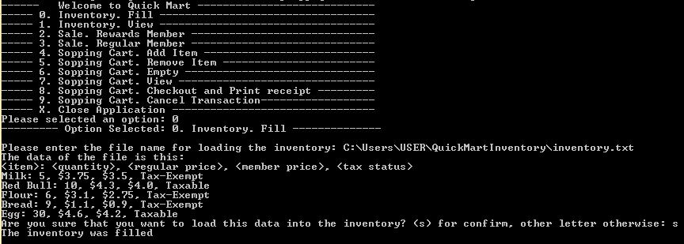

<h1> Quick Mart Project </h1>

<em>The Project was made with Maven in IntelliJ 2016.2.4</em>

<h2>UML Solution</h2>

  <h3>Main menu of the Project. You need to select an option</h3>
    

<h2>Instructions for running the project</h2>
<ul>
<li>The project as created as Maven project, you need to have maven installed (run the command: mvn package on project). Please see: https://maven.apache.org/install.html</li>
<li>The other way is that if you have intalled any IDE intragrate with maven, for example: IntelliJ, Netbeans, Eclipse,..  these will do the work for you </li>
<li>If for any reason you can not  run the project, please contact to developer </li>
</ul>

<h2>Explanation of some functionalities: (For seeing all, please run the project)</h2>

  <h3>Main menu of the Project. You need to select an option</h3>
    

  <h3>(0) Option to fill Inventory. You need to write the path of the file and in one second step confirm for passing the data to the inventory</h3>
    

  <h3>(2 or 3) Option to create customer</h3>
    

  <h3>(4) Option to add item to shopping Cart</h3>
    

  <h3>(8) Option to Checkout and Print receipt</h3>
    

